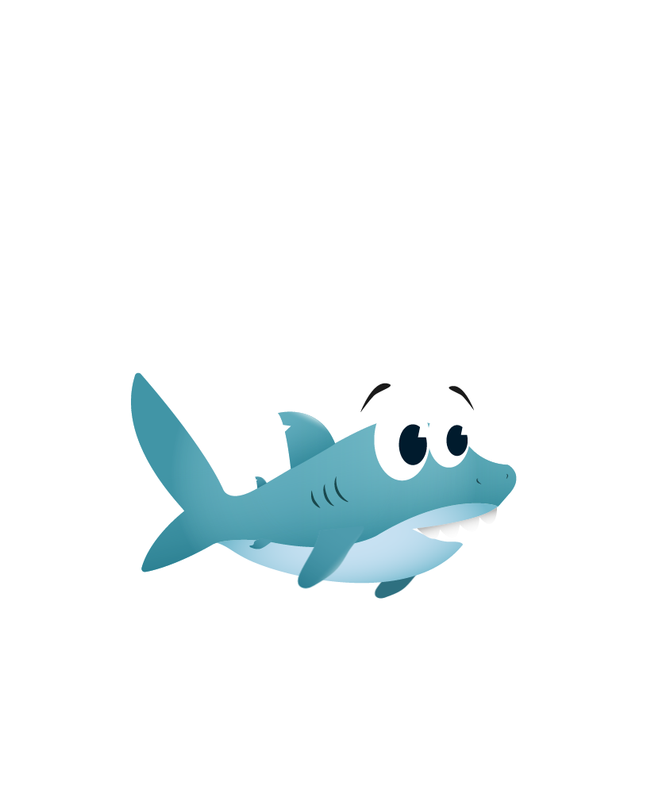

# 🦈 Sharkie

> A 2D underwater adventure game built with vanilla JavaScript and HTML5 Canvas.


Dive into the depths with Sharkie — battle jellyfish and pufferfish, dodge poison clouds, collect coins, and defeat the endboss. Built from the ground up with no libraries or frameworks.

<p align="center">
  
</p>

> _Screenshot/demo GIF coming soon._

---

## ✨ Features

- 🎮 **Two attack styles** — Bubble attack (ranged) and fin slap (melee)
- 🐡 **Enemy variety** — 3 pufferfish color variants, 4 jellyfish color variants, 1 endboss with hurt/attack/death animations
- 📊 **Three status bars** — Health, poison ammo, coins
- 🔊 **Audio manager** — Centralized sound control with persistent mute
- 📱 **Mobile-friendly** — Touch controls and landscape lock
- ⏸️ **Pause & dialogs** — In-game controls overlay, credits, privacy & legal notices
- 🌐 **Bilingual UI** — English / German toggle (coming in v2)
- 💾 **Preferences persist** — Language and mute state saved to `localStorage`

---

## 🛠️ Tech Stack

| Layer    | Technology                  |
| -------- | --------------------------- |
| Engine   | Vanilla JavaScript (ES2022) |
| Graphics | HTML5 Canvas 2D             |
| Layout   | CSS3 with custom properties |
| Fonts    | Bubblegum Sans              |
| Audio    | Web Audio via `<audio>`     |
| Build    | _None — pure static files_  |

No bundlers, no transpilers, no npm — just a browser and a file server.

---

## 🏗️ Architecture

```
                    ┌──────────────┐
                    │   index.html │
                    └──────┬───────┘
                           │
                    ┌──────▼───────┐
                    │    Keyboard  │◄── Arrow keys, D, Space
                    └──────┬───────┘
                           │
  ┌────────────────────────▼────────────────────────┐
  │                      World                       │
  │  ┌───────────┐  ┌───────────┐  ┌──────────────┐ │
  │  │ Character │  │   Level   │  │  StatusBars  │ │
  │  └─────┬─────┘  └─────┬─────┘  └──────────────┘ │
  │        │              │                          │
  │        ▼              ▼                          │
  │  ┌───────────┐  ┌───────────────────────────┐  │
  │  │  Bubbles  │  │  Enemies   Collectables   │  │
  │  │           │  │  ───────   ───────────    │  │
  │  │           │  │  Puffer    Coin           │  │
  │  │           │  │  Jelly     PoisonWater    │  │
  │  │           │  │  Endboss                  │  │
  │  └───────────┘  └───────────────────────────┘  │
  └───────────────────────┬──────────────────────────┘
                          │
                    ┌─────▼──────┐
                    │  Canvas 2D │
                    └────────────┘
```

`World` is the orchestrator: it runs the `requestAnimationFrame` draw loop and a 200ms collision interval. `Character` reads keyboard state; enemies self-animate via interval registries. Everything is built on a small inheritance tree (`DrawableObject → MovableObject → Enemy → …`).

---

## 🚀 Run Locally

Any static file server works. The game has no build step.

```bash
# Python
python3 -m http.server 8000

# Node
npx serve .

# VS Code
# Install "Live Server" extension → right-click index.html → "Open with Live Server"
```

Then open [http://localhost:8000](http://localhost:8000).

> ⚠️ Opening `index.html` directly via `file://` **will not work** — browsers block audio and image loading over `file://`. Use a local server.

---

## 🎮 Controls

| Action         | Key          |
| -------------- | ------------ |
| Move           | `← ↑ → ↓`    |
| Bubble attack  | `D`          |
| Fin slap       | `Space`      |
| Pause / menu   | Pause button |
| Mute           | Mute button  |

On touch devices, on-screen buttons replace the keyboard.

---

## 📁 Project Structure

```
sharkie/
├── index.html              ← entry point, loads all scripts
├── style.css               ← global styles + design tokens
├── css/                    ← feature-scoped stylesheets
│   ├── buttons.css
│   ├── dialog-*.css        ← controls / credits / privacy / impressum
│   ├── screen-*.css        ← start / gameplay / win / game-over
│   └── tokens.css          ← CSS variables (colors, spacing, radius)
├── js/
│   ├── constants.js        ← game constants (FPS, damage, thresholds)
│   ├── character-images.js ← image registry for the hero
│   ├── game.js             ← init + input wiring
│   ├── menu.js             ← dialogs, mute, screen transitions
│   └── i18n.js             ← translations + language toggle
├── models/                 ← class hierarchy
│   ├── drawable-object.class.js
│   ├── movable-object.class.js
│   ├── enemy.class.js               ← base for Pufferfish, Jellyfish
│   ├── animated-collectable.class.js ← base for Coin, PoisonWater
│   ├── character.class.js + character-animations + character-actions
│   ├── pufferfish.class.js / jellyfish.class.js / endboss.class.js
│   ├── coin.class.js / poison-water.class.js / bubble.class.js
│   ├── status-bar.class.js / background-object.class.js
│   ├── audio.class.js / keyboard.class.js / level.class.js / world.class.js
├── levels/
│   └── level1.js           ← level composition (enemies, items, bg tiles)
├── img/                    ← sprite sheets
├── sounds/                 ← SFX and music
└── fonts/                  ← Bubblegum Sans
```

---

## 🧠 Notable Design Decisions

- **Interval Registry** — All `setInterval` calls are routed through a central `IntervalManager` that respects the pause flag and can tear them down on restart. No leaked timers between rounds.
- **Inheritance over composition** — Enemies share a `loadColorVariants()` pattern on an `Enemy` base class, so a new enemy color is a one-line change.
- **Design tokens** — Colors, spacing, radii, and shadows live in CSS custom properties. Theming is one variable away.
- **Zero build step** — Keeps the project deployable anywhere with a static host and easy to read for anyone opening it in VS Code.

---

## 👤 Credits

**Created by Aljoscha Naß** as the final project of the Developer Academy.

- Contact: [nassaljoscha@gmail.com](mailto:nassaljoscha@gmail.com)
- Music & SFX: Pixabay, Mixkit (royalty-free)
- Font: [Bubblegum Sans](https://fonts.google.com/specimen/Bubblegum+Sans)

---

## 📜 License

This project is for educational and portfolio purposes. All assets are licensed under their respective royalty-free licenses.
